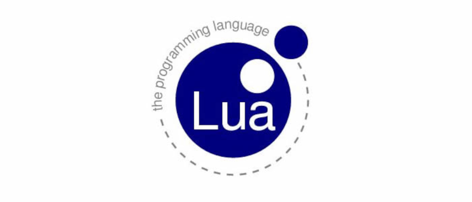

# lua

## Exercícios básicos na Linguagem Lua

## Lógica de Programação

 Na realidade um programa é um conjunto de milhares de instruções que indicam ao computador, passo a passo, o que ele precisa fazer. Logo, um programa nada mais é do que um algoritmo computacional descrito em uma linguagem de programação, no caso, utilisando a  simplicidade da linguagem Python que possui um enorme potencial não apenas como uma linguagem poderosa de programação, mas como uma  ferramenta para mudar o seu futuro como desenvolvedor...
 

 

<h2>:bookmark_tabs: Descrição</h2>

# O que é Lua?

Lua é uma linguagem de programação poderosa, eficiente e leve, projetada para estender aplicações. Ela permite programação procedural, programação orientada a objetos, programação funcional, programação orientada a dados e descrição de dados.

Lua combina sintaxe procedural simples com poderosas construções para descrição de dados baseadas em tabelas associativas e semântica extensível. Lua é tipada dinamicamente, é executada via interpretação de bytecodes para uma máquina virtual baseada em registradores, e tem gerenciamento automático de memória com coleta de lixo incremental. Essas características fazem de Lua uma linguagem ideal para configuração, automação (scripting) e prototipagem rápida.

***

# Lua é pequena

Incluir Lua numa aplicação não aumenta quase nada o seu tamanho. O pacote de Lua 5.4.4, contendo o código fonte e a documentação, ocupa 353K comprimido e 1.3M descompactado. O fonte contém cerca de 30000 linhas de C. No Linux de 64 bits, o interpretador Lua contendo todas as bibliotecas padrões de Lua ocupa 281K e a biblioteca Lua ocupa 468K.

# Lua é livre

Lua é software livre de código aberto, distribuída sob uma licença muito liberal (a conhecida licença MIT). Lua pode ser usada para quaisquer propósitos, incluindo propósitos comerciais, sem qualquer custo ou burocracia. Basta fazer o download no site oficial e usá-la.

## IMPORTANTE: 
 
  
 
 
Você tem todo o direito de usar esse material para seu próprio aprendizado. Espero que seja útil o conteúdo disponibilizado.
 